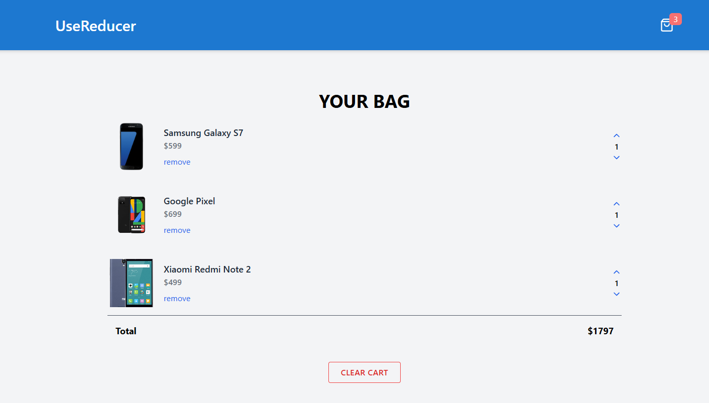
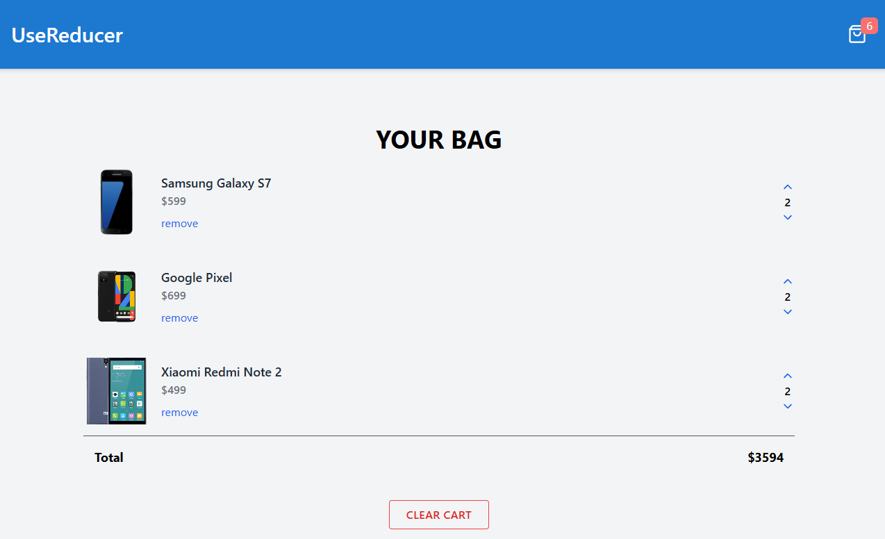
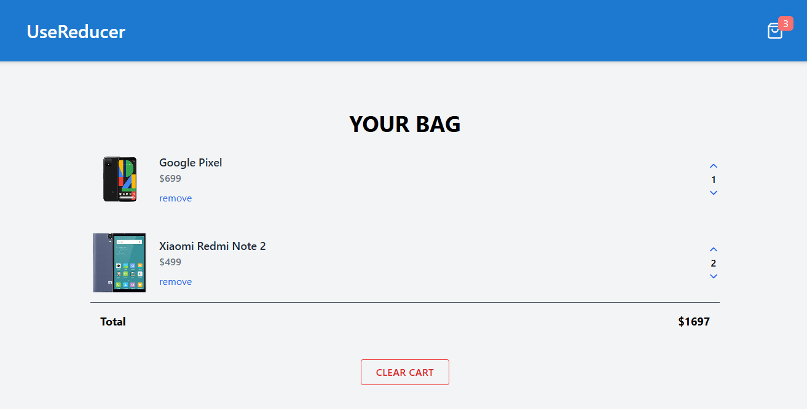
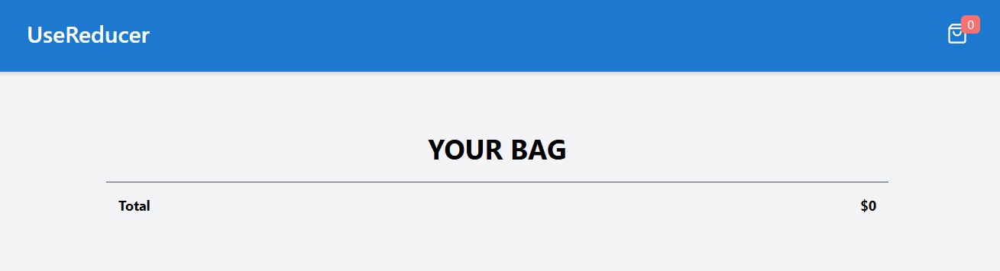

## 🛒 MobileCart App

I developed a responsive MobileCart [MobileCart](https://mobilecartreact.netlify.app/) built with **React** and **Tailwind CSS**, allowing users to:

📦 Tech Stack Used

⚛️ React (with useState)

🧠 JavaScript ES6+

🎨 Tailwind CSS

🌐 HTML5 (semantic, responsive)

🛒 Responsive Mobile Cart - Feature Guide

✨ Features Overview

Functionality

Logic Used

✅ Clear All Products

setproducts([])

✅ Remove Single Product

filter()

✅ Quantity Management

map() + filter()

✅ Total Price Calculation

reduce()

✅ Cart product Count

reduce()

🧹 1. Clear Cart Button

Action: Clicking the CLEAR CART button will:

🗑️ Remove all product products from the cart.

💲 Set Total to $0.00.

🧺 Set Cart Count in Header to 0.

🔁 On reload, default product list returns (from data.js).

```js
const clearCart = () => {
  setproducts([]);
};
```

❌ 2. Remove Individual Product

Action: Clicking remove beside a product removes that product only.

```js
const remove = (id) => {
  setproducts((prevproducts) =>
    prevproducts.filter((product) => product.id !== id)
  );
};
```

🔼🔽 3. Quantity Control with Validation

Action:

⬆️ Clicking the Up Arrow → quantity + 1

⬇️ Clicking the Down Arrow → quantity - 1

❗ If quantity === 0 → Product is removed

```js
const increase = (id) => {
  setproducts((prevproducts) =>
    prevproducts.map((product) =>
      product.id === id
        ? { ...product, quantity: product.quantity + 1 }
        : product
    )
  );
};
```

```js
const decrease = (id) => {
  setproducts((prevproducts) =>
    prevproducts
      .map((product) =>
        product.id === id
          ? { ...product, quantity: product.quantity - 1 }
          : product
      )
      .filter((product) => product.quantity > 0)
  );
};
```

💰 4. Total Cost Calculation

Action: Always reflects live sum of: price × quantity

```js
const total = products.reduce((acc, product) => acc + product.price \* product.quantity, 0);
```

🔢 5. Total Cart product Count

Action: Shows total quantity of all products (for cart badge).

## 📸 Preview









## 📚 Lessons Learned

Practiced lifting state for quantity control

Gained hands-on experience with flex + responsive design in Tailwind

Learned to separate components for better reusability

## 🧩 Challenges Faced

1.  🧩 Component Communication (Props Handling)
    Passing functions like `onIncrementQuantity`, `onDecrementQuantity`, and `removeBtn` from the parent to child components was initially confusing. Understanding how to lift state and control child behavior from the parent took some practice.

2.  📱 Mobile Responsiveness
    While Tailwind provides great responsive utilities, getting the layout to look good on **small screens** was tricky.
    Some common issues:

- Buttons not aligned properly on mobile
- Image sizes breaking layout
- Quantity controls overlapping text

Resolved using:

- `flex-col sm:flex-row`
- Proper use of `self-end`, `sm:items-center`, and `gap-4`
- Responsive image sizes like `w-full sm:w-24`

3.  🔁 Quantity Controls
    Handling increment and decrement functionality per item required proper identification using `id`. It was easy to accidentally update the wrong item if the logic wasn’t correct.

4.  🧪 Preventing Errors
    Making sure the quantity didn’t go below `0` was something that had to be manually handled (future improvement idea).

5.  💄 Consistent Styling
    Keeping consistent padding, margins, and font sizes across mobile and desktop took trial and error with Tailwind’s utility classes.

## 📦 Setup

1. Clone the repo:

   ```bash
   git clone https://github.com/Minoar98/MobileCart.git
   cd MobileCart
   ```

2. Install dependencies:

   ```bash
   npm install
   ```

3. Run the app:
   ```bash
   npm run dev
   ```

## Authors

- Github: [@Syed Minoar Hasan](https://github.com/Minoar98)
- Email: [minoarhasan@gmail.com](mailto:minoarhasan@gmail.com)
- Linkedin: [Syed Minoar Hasan](https://www.linkedin.com/in/syed-minaor-hasan-3404b617a/)
